# 12-Object Relational Mapping- E-Commerce Backend
by Jacob Hegan

UWA Full-Flex Bootcamp February 2021

[Video Walkthrough](https://drive.google.com/file/d/1kK9yaGGGg8kcI4hZ05Fh52eSw5hSJ-ia/view)

[GitHub Repository](https://github.com/heganjr/13-ecommerce-backend-JH)

---

[](https://choosealicense.com/licenses/mit/)

---

## Description

To allow use of e-commerce technologies allowing companies to compete with other ecommerce companies

## Table of Contents

- [Installation](#installation)
- [Usage](#usage)
- [Screenshots](#screenshot)
- [How To Contribute](#how-to-contribute)
- [Credits](#credits)
- [License](#license)

## Installation

If cloning the repo locally:

npm i
- to install all dependencies found in package.json

- create a .env file with:

DB_USER='root'
DB_PW='insert SQL password here
DB_NAME='ecommerce_db'

npm run seed
- to push seed data to the ecommerce database

npm start
- to launch the server at https://localhost:3001


## Usage

```
AS A manager at an internet retail company
I WANT a back end for my e-commerce website that uses the latest technologies
SO THAT my company can compete with other e-commerce companies
```

---

```
GIVEN a functional Express.js API
WHEN I add my database name, MySQL username, and MySQL password to an environment variable file
THEN I am able to connect to a database using Sequelize
WHEN I enter schema and seed commands
THEN a development database is created and is seeded with test data
WHEN I enter the command to invoke the application
THEN my server is started and the Sequelize models are synced to the MySQL database
WHEN I open API GET routes in Insomnia Core for categories, products, or tags
THEN the data for each of these routes is displayed in a formatted JSON
WHEN I test API POST, PUT, and DELETE routes in Insomnia Core
THEN I am able to successfully create, update, and delete data in my database
```

### Screenshot

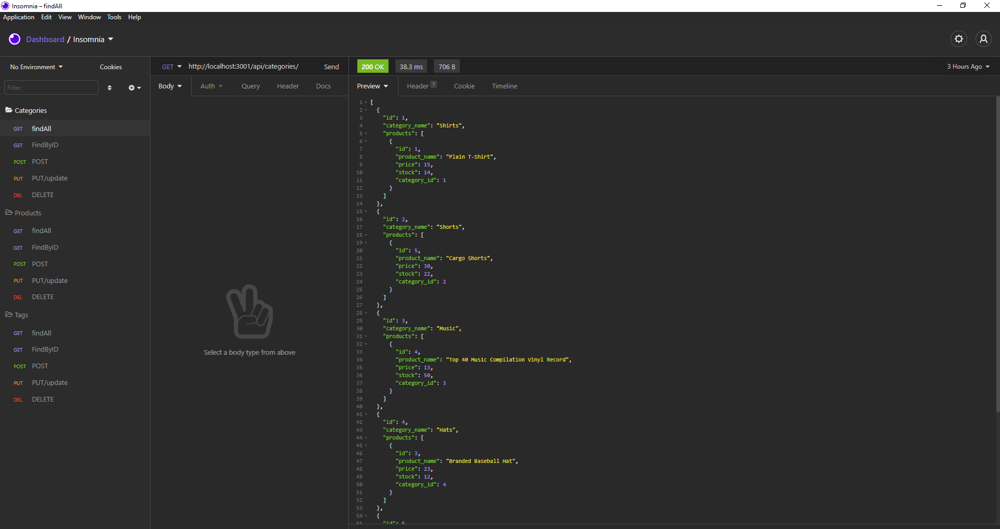

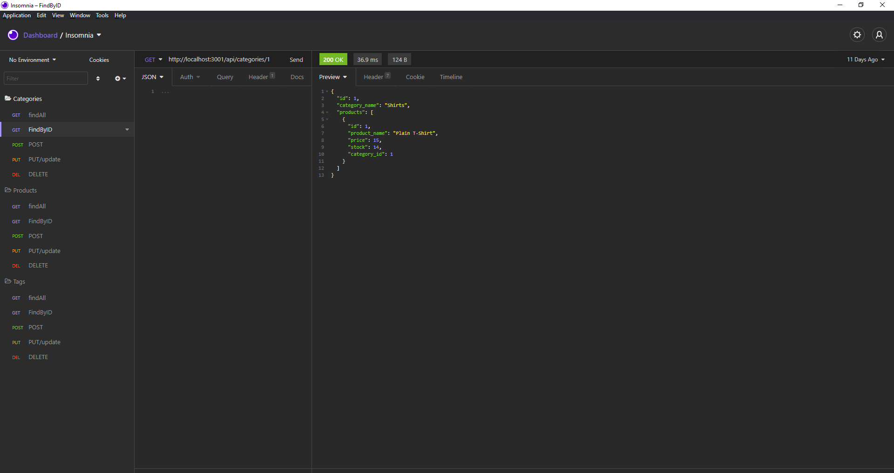

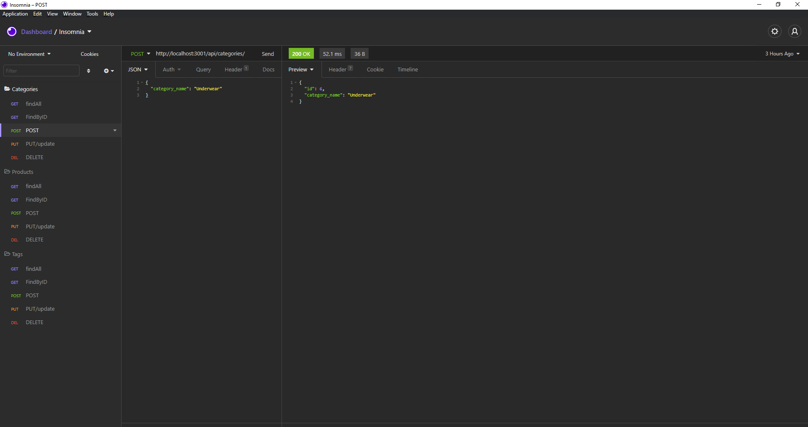


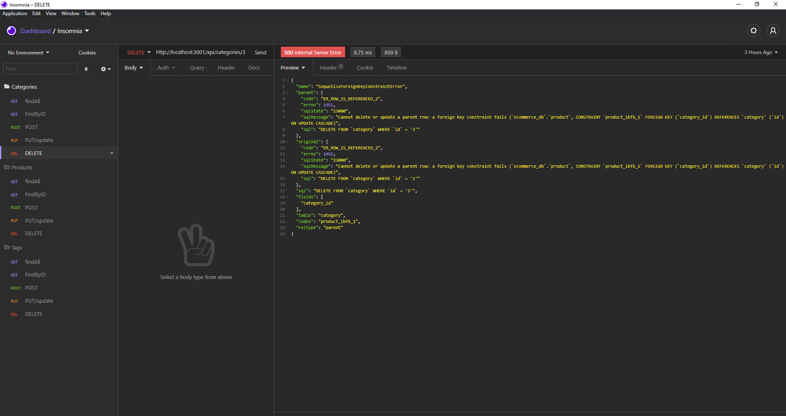

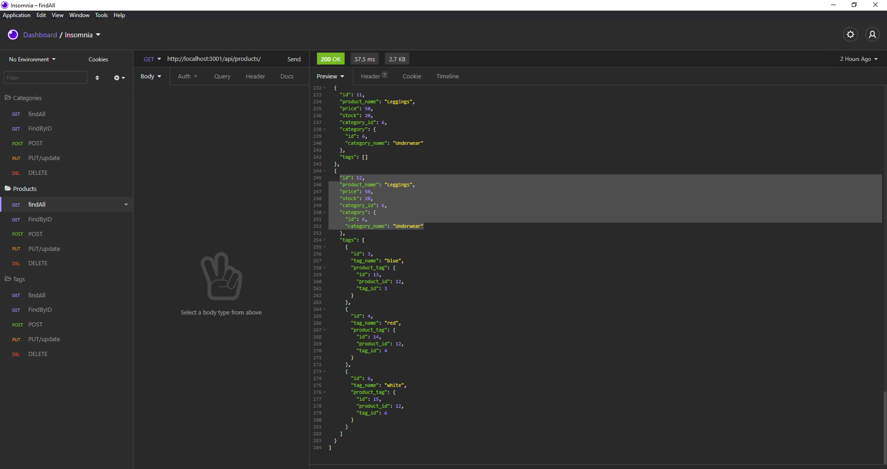

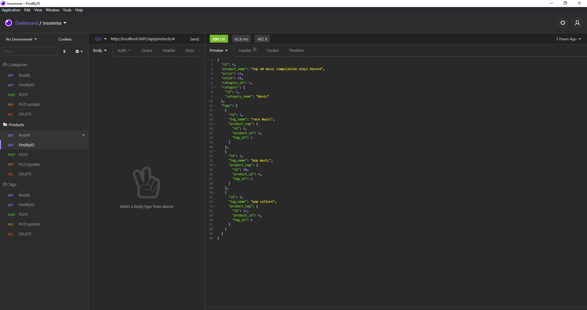

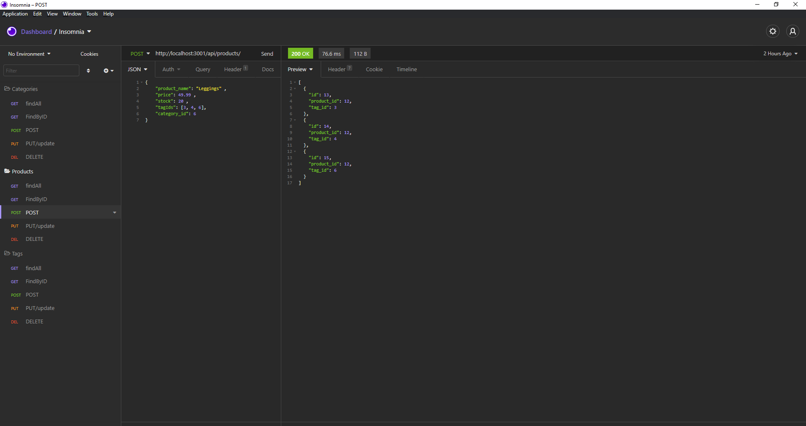

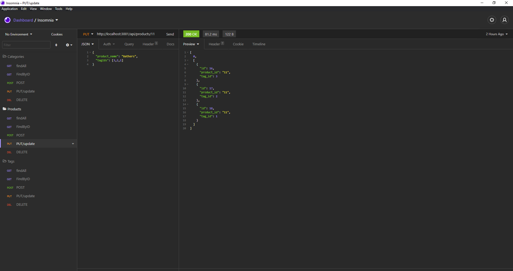

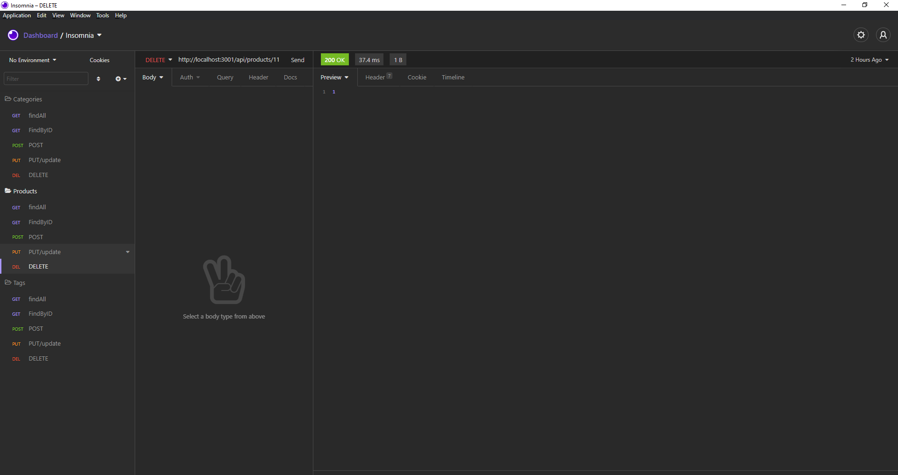

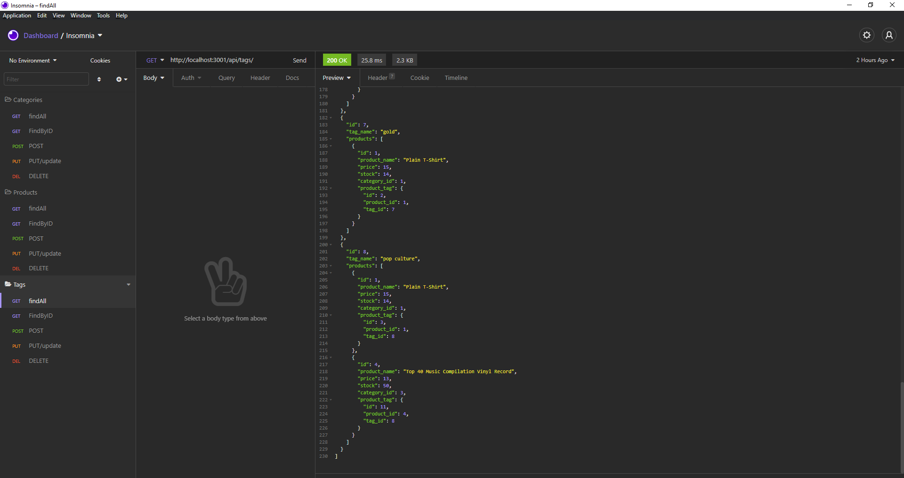

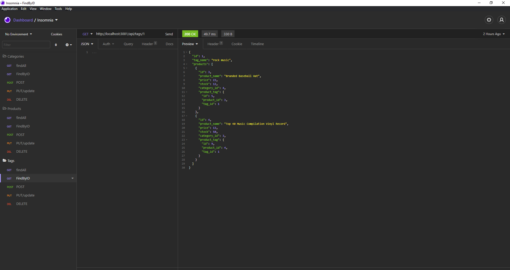

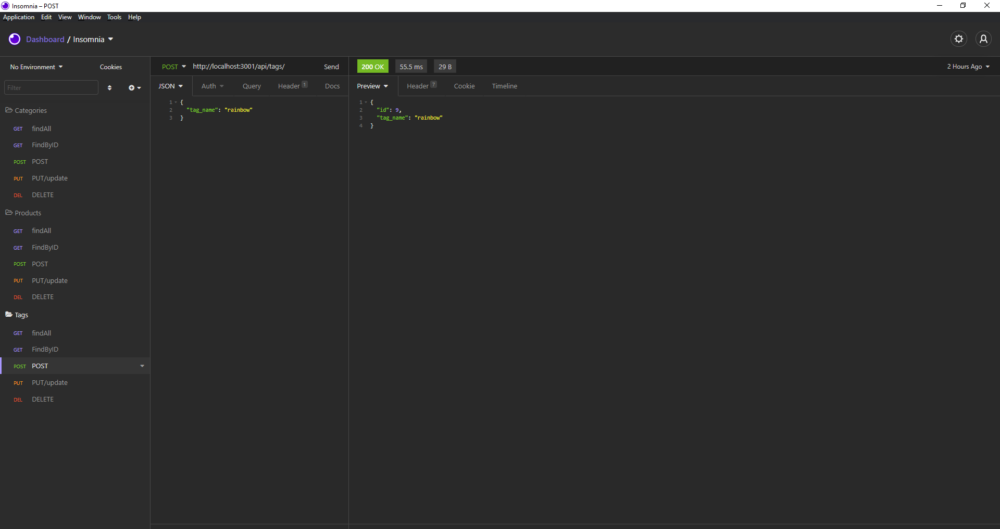

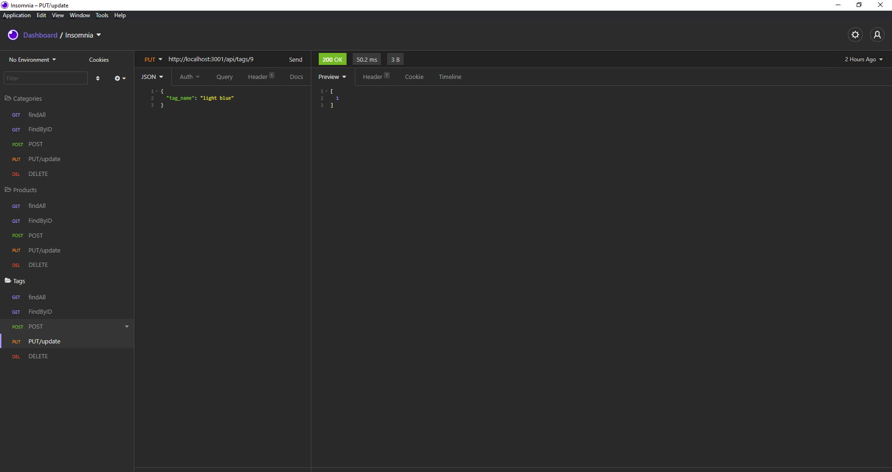

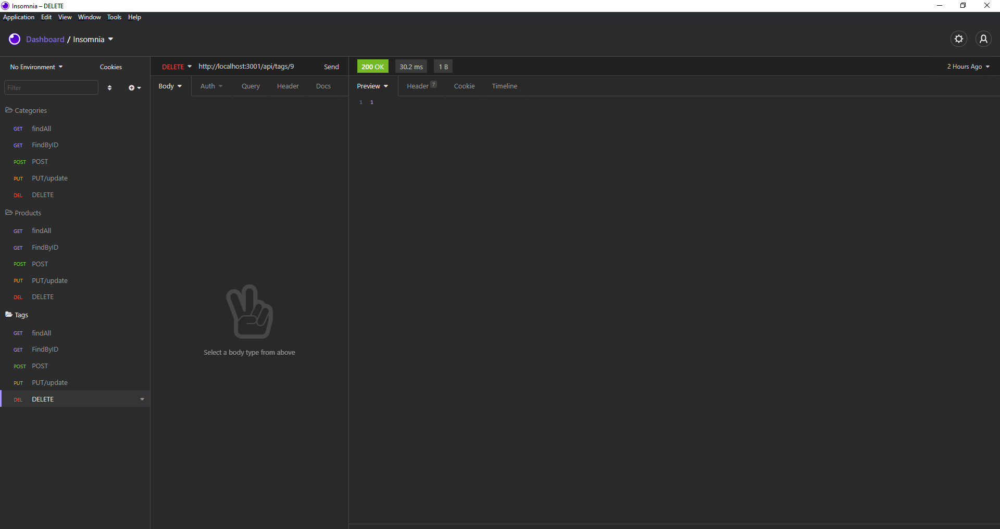


## How to Contribute

---

Contributions are not possible.

If there are issues you can contact me through my GitHub profile found in the credits below.

I am happy to take on any suggestions and feedback!

---

## Credits

[hegan.jr](https://github.com/heganjr)

---

## License

[MIT](https://choosealicense.com/licenses/mit/)

MIT License

  Copyright (c) [2021] [Jacob Hegan]
  
  Permission is hereby granted, free of charge, to any person obtaining a copy
  of this software and associated documentation files (the "Software"), to deal
  in the Software without restriction, including without limitation the rights
  to use, copy, modify, merge, publish, distribute, sublicense, and/or sell
  copies of the Software, and to permit persons to whom the Software is
  furnished to do so, subject to the following conditions:
  
  The above copyright notice and this permission notice shall be included in all
  copies or substantial portions of the Software.
  
  THE SOFTWARE IS PROVIDED "AS IS", WITHOUT WARRANTY OF ANY KIND, EXPRESS OR
  IMPLIED, INCLUDING BUT NOT LIMITED TO THE WARRANTIES OF MERCHANTABILITY,
  FITNESS FOR A PARTICULAR PURPOSE AND NONINFRINGEMENT. IN NO EVENT SHALL THE
  AUTHORS OR COPYRIGHT HOLDERS BE LIABLE FOR ANY CLAIM, DAMAGES OR OTHER
  LIABILITY, WHETHER IN AN ACTION OF CONTRACT, TORT OR OTHERWISE, ARISING FROM,
  OUT OF OR IN CONNECTION WITH THE SOFTWARE OR THE USE OR OTHER DEALINGS IN THE
  SOFTWARE.

---
